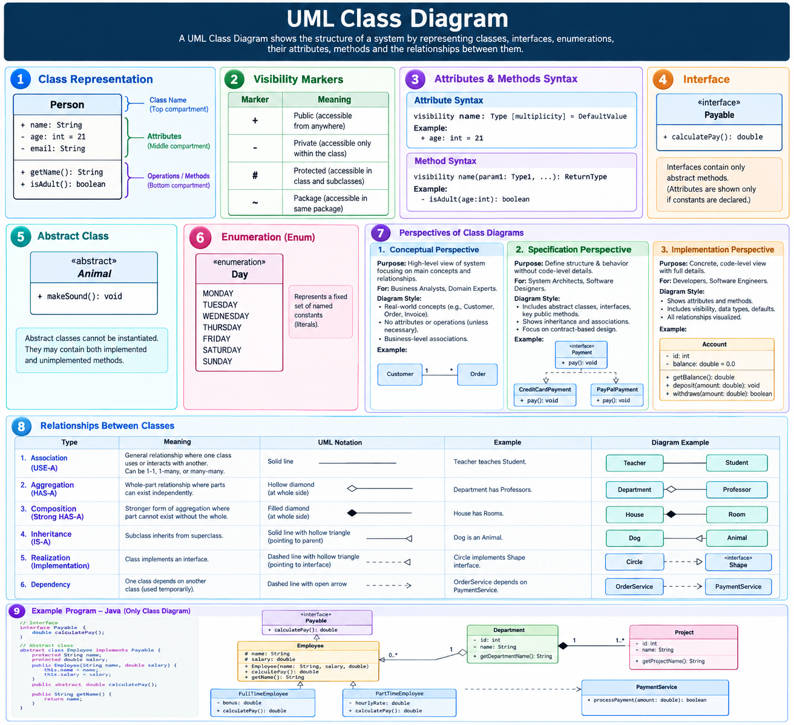

# UML (Unified Modeling Language) — Quick Revision

## What is UML?

**UML (Unified Modeling Language)** is a standard way of using diagrams to **plan, understand, and explain a software system**.

### In Simple Words

UML is the **blueprint of a software system**. It shows:

- What parts exist in the system
- How those parts are connected
- How users and objects interact
- How the system behaves step by step

UML helps developers understand the design before or while writing code.

## Real-Life Example

Before building a house, an engineer creates a blueprint showing rooms, doors, plumbing, and electrical connections.

Similarly, before building software, developers can use UML diagrams to show classes, objects, workflows, and interactions.

> **House blueprint = UML diagram for software**

## Why Do We Use UML?

- To plan a system before coding
- To explain the design clearly to the team
- To understand complex systems easily
- To find design problems early
- To document the system for future reference

---

## Main Types of UML Diagrams

UML diagrams are divided into two categories:

| Type | Shows | Easy Meaning |
| --- | --- | --- |
| **Structural Diagrams** | Static structure of the system | What the system **has** |
| **Behavioral Diagrams** | Dynamic behavior of the system | What the system **does** |

### Easy Memory Trick

- **Structural = Nouns** such as class, object, component, and server
- **Behavioral = Actions** such as login, payment, booking, and message flow

---

## 1. Structural Diagrams

Structural diagrams show the parts of a system and how they are connected. They do not mainly focus on what happens while the program is running.

| Diagram | Purpose |
| --- | --- |
| **Class Diagram** | Shows classes, attributes, methods, and relationships |
| **Object Diagram** | Shows actual objects at a particular moment |
| **Component Diagram** | Shows software modules and their connections |
| **Composite Structure Diagram** | Shows the internal parts of a class or component |
| **Deployment Diagram** | Shows where software runs, such as servers and devices |
| **Package Diagram** | Groups related classes or components into packages |
| **Profile Diagram** | Customizes UML for a particular platform or domain |

### Simple Example

In an online shopping application, a structural diagram can show:

- `Customer` class
- `Product` class
- `Order` class
- The relationship between Customer, Product, and Order

---

## 2. Behavioral Diagrams

Behavioral diagrams show how a system works during execution. They focus on actions, workflows, interactions, and changes over time.

| Diagram | Purpose |
| --- | --- |
| **Use Case Diagram** | Shows what users can do in the system |
| **Activity Diagram** | Shows a workflow step by step, like a flowchart |
| **Sequence Diagram** | Shows messages exchanged between objects in time order |
| **Communication Diagram** | Shows how connected objects communicate |
| **State Machine Diagram** | Shows how an object changes from one state to another |
| **Interaction Overview Diagram** | Gives an overview of multiple interactions |
| **Timing Diagram** | Shows how objects behave according to time |

### Simple Example

For an online shopping application, a behavioral diagram can show:

1. Customer selects a product.
2. Customer adds it to the cart.
3. Customer makes the payment.
4. System creates the order.
5. System sends a confirmation.

---

## Most Important UML Diagrams for LLD

For **Low-Level Design (LLD)**, focus mainly on:

### 1. Class Diagram — Most Important

It shows:

- Classes
- Attributes or variables
- Methods or functions
- Relationships between classes

It helps convert a design into actual object-oriented code.

### 2. Sequence Diagram

It shows how different objects communicate with each other in a particular order.

For example, during payment:

`Customer → OrderService → PaymentService → Bank`

### 3. Use Case Diagram

It gives a high-level view of what each user can do in the system.

For example:

- Customer can search products and place orders.
- Admin can add products and manage orders.

### 4. Activity Diagram

It explains the complete workflow of a feature step by step.

For example:

`Select product → Add to cart → Pay → Place order`

---

## Quick Comparison

| Diagram | Main Question It Answers |
| --- | --- |
| **Class Diagram** | What classes are present and how are they related? |
| **Use Case Diagram** | What can each user do? |
| **Sequence Diagram** | In what order do objects communicate? |
| **Activity Diagram** | What are the steps in the workflow? |
| **State Machine Diagram** | How does an object change its state? |
| **Deployment Diagram** | Where is the software deployed? |

---

## Final Revision Points

- UML stands for **Unified Modeling Language**.
- UML is used to visually design and document software systems.
- UML is a modeling language, **not a programming language**.
- **Structural diagrams** show what the system has.
- **Behavioral diagrams** show what the system does.
- UML contains **7 structural diagrams** and **7 behavioral diagrams**.
- The **Class Diagram** is the most important UML diagram for LLD.
- Sequence, Use Case, and Activity diagrams are also useful in LLD interviews.

## One-Line Summary

> **UML is a collection of diagrams used as a blueprint to understand, design, and explain a software system.**
---

